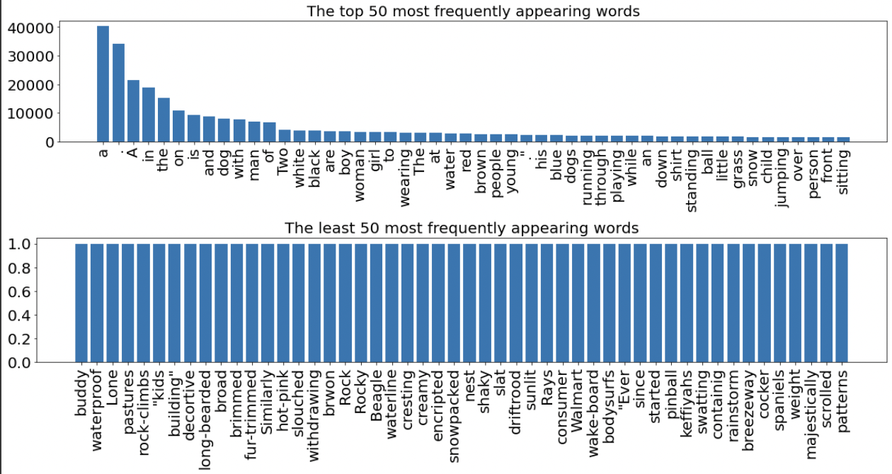
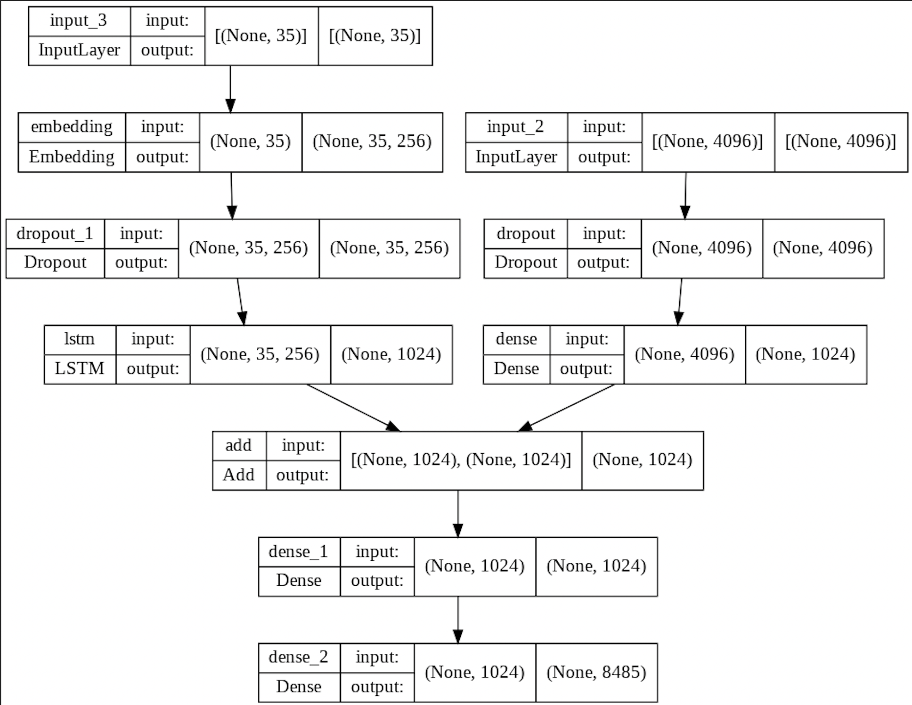
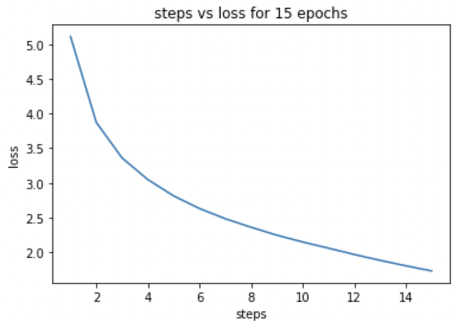
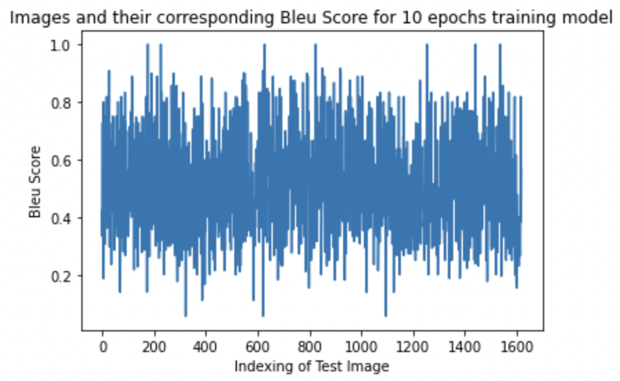
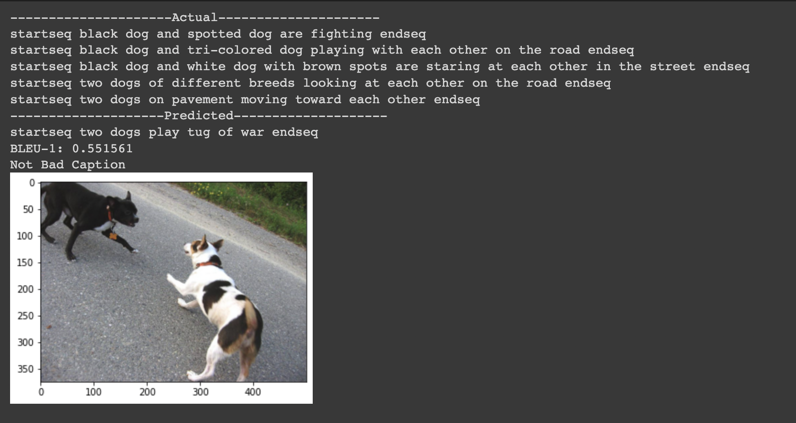
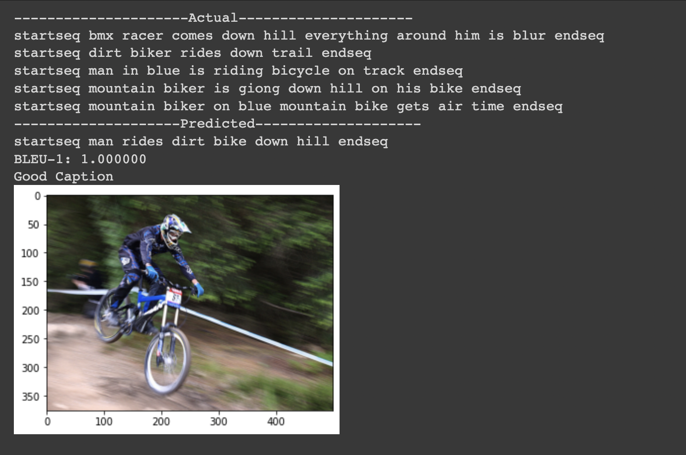
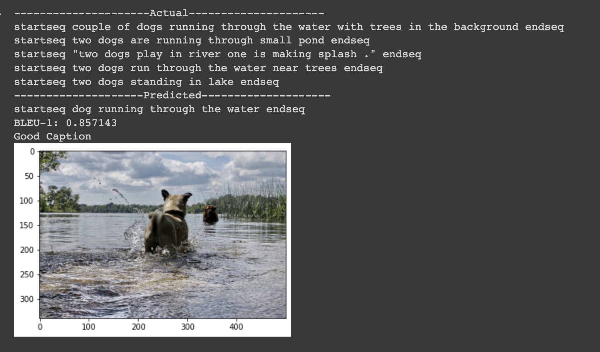
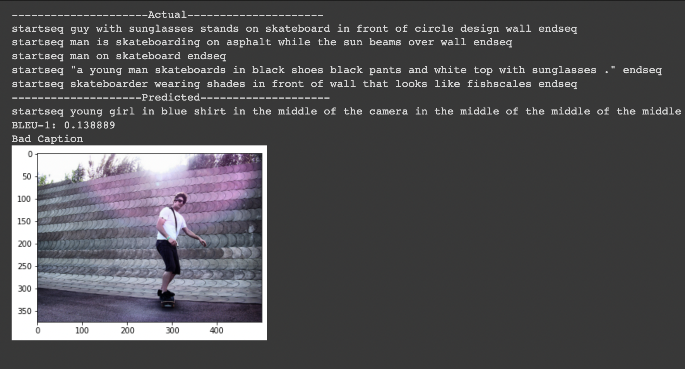
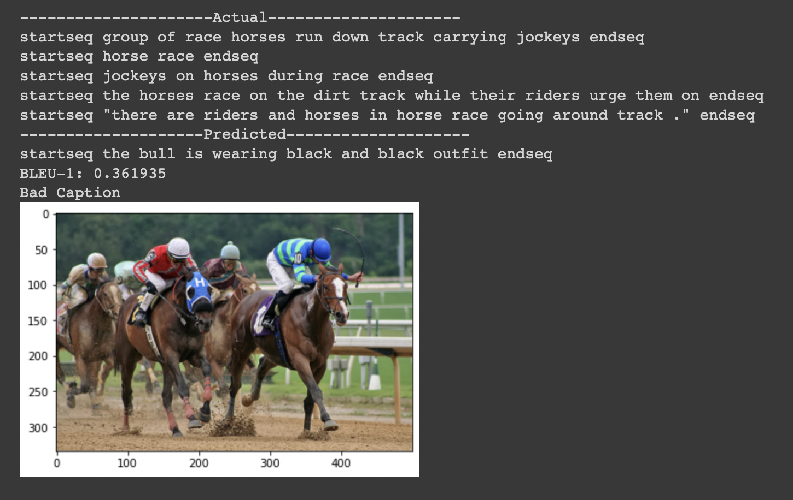
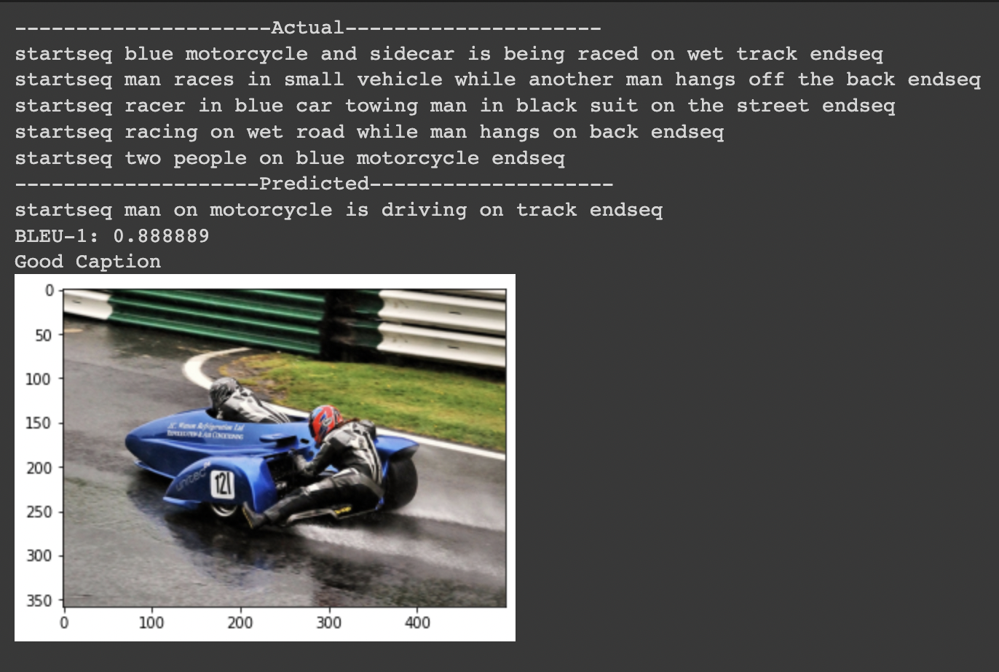

# Image_Captioning_Tensorflow_Flickr8K

Deep Learning Image Captioning Model on Flickr8K dataset using TensorFlow and Keras in python language.
* <a href="#Introduction">Introduction</a>
* <a href="#Flickr8K Dataset">Flickr8K Dataset</a>
* <a href="#Image Feature Extraction">Image Feature Extraction</a>
* <a href="#Caption Data Analysis">Caption Data Analysis</a>
* <a href="#Prepare Captions">Prepare Captions</a>
* <a href="#Model Architecture">Model Architecture</a>
  * <a href="#Encoder">Encoder</a>
  * <a href="#Decoder">Decoder</a>
* <a href="#Loss Function">Loss Function</a>
* <a href="#Training the model">Training the model</a>
* <a href="#Generating the captions">Generating the captions</a>
* <a href="#BLEU Score">BLEU Score</a>
* <a href="#Testing the model">Testing the model</a>
* <a href="#Results">Results</a>
* <a href="#Future Work">Future Work</a>
* <a href="#References">References</a>
<h2 id="Introduction">Introduction</h2>
Training the machines to caption images has been a very interesting topic in the recent times. This task is a combination of image data understanding, feature extraction, translation of visual representations into natural languages such as English. It has its applications including recommen- dations in editing applications, usage in virtual assistants, for image indexing, for visually impaired people, in social media, and several other natural language processing applications. Working model of the image caption generator is built by using CNN (Convolutional Neural Network) and LSTM (Long short term memory) units. Flickr8K dataset is used to train the model consisting of approximately 8000 unique images and each image is mapped to five different captions which describe the image. After training the model, predictions are made on the test data and BLEU scores are calculated to see the performance of the model.
<h2 id="Flickr8K Dataset">Flickr8K Dataset</h2>
Flick8K dataset is a new benchmark collection for sentence-based image description and search, consisting of approximately 8,000 images that are each paired with five different captions which provide clear descriptions of the salient entities and events. The images are chosen from six different Flickr groups, and tend not to contain any well-known people or locations, but were manually selected to depict a variety of scenes and situations. It consists of exactly:
1. 8091 images in JPEG format with different shapes and sizes. 
2. 5 captions for each image i.e. total of 40455 captions.
<h2 id="Image Feature Extraction">Image Feature Extraction</h2>
Convolutional Neural Network (CNN) method is used for image feature extraction. VGG16 model is a series of convolutional layers followed by a few dense (or fully connected) layers. The input layer to the last max pooling layer (labeled by 7 x 7 x 512) is regarded as feature extraction part of the model, while the rest of the network is regarded as classification part of the model. After loading VGG16 and restructuring by excluding the classification part of the model , we load the input image with the size expected by the model, in this case, 224Ö224, then we convert the image pixels to numpy array whose dimensions are reshaped for the model. After preprocessing the images for VGG16, general features are extracted which are then used further for the image classifiers.
<h2 id="Caption Data Analysis">Caption Data Analysis</h2>
After loading the caption data, some analysis is done on the captions including the visualisation of the frequency distribution of the words- most common 50 words and least common 50 words.

<h2 id="Prepare Captions">Prepare Captions</h2>
Each caption consists of an English sentence. To prepare this for training, we perform the following steps on each sentence:
1. Clean it by converting all words to lower case and removing punctuation, words with numbers and short words with a single character.
2. Add ‘<startseq>’ and ‘<endseq>’ tokens at the beginning and end of the sentence.
3. Tokenize the sentence by mapping each word to a numeric word ID. It does this by building
a vocabulary of all the words that occur in the set of captions.
4. Extend each sentence to the same length by adding padding sequences. This is needed because the model expects every data sample to have the same fixed length.
<h2 id="Model Architecture">Model Architecture</h2>
<h3 id="Encoder">Encoder</h3>
  The encoder takes the images as input and produces the encoded image vectors that capture the essential features of the image.
1. Image Feature Layers- Consist of Input1, Dropout and Dense layers with Relu activation function.
2. Sequence Feature Layers- Consist of Input2, Embedding, Dropout and LSTM layers.
<h3 id="Decoder">Decoder</h3>
  The decoder generates image captions word by word using a Recurrent Neural Network - LSTMs which is able to sequentially generate words. The input for the decoder is the encoded image feature vectors from CNN and the encoded image captions produced in data preprocessing stage.
It gets combined input from Input1 and Input2, consists of a Dense layer with Relu activation function and the output as Dense layer with Softmax activation function.
  

<h2 id="Loss Function">Loss Function</h2>
The nature of our RNN output is a series likelihood of words’ occurences, and in order to quantify the quality of the RNN output, we propose to use Cross Entropy Loss. This is the most popular and effective measurement for the performance of a classification model whose output is a probability value between 0 and 1. The categorical cross-entropy is applied in multiclass classification scenarios. in the formula, we multiply the actual outcome with the logarithm of the outcome produced by the model for over more than two classes and then sum up.
The categorical cross-entropy is appropriate in combination with an activation function such as
softmax that can produce several probabilities for the number of classes that sum up to 1.

<h2 id="Training the model">Training the model</h2>
  
A Data Generator function is defined to get data in batch instead taking it altogether to avoid session crash. The entire data is split into train and test and the model training is done on the train data. The loss decreases gradually over the iterations, number of epochs and batch size are assigned accordingly for better results.
  

<h2 id="Generating the captions">Generating the captions</h2>
  Captions are generated for the image by converting the predicted index from the model into a word. All the words for the image are generated, the caption starts with ’startseq’ and the model continues to predict the caption until the ’endseq’ appeared.
<h2 id="BLEU Score">BLEU Score</h2>
  
BLEU (Bilingual Evaluation Understudy) is a well-acknowledged metric to measure the similarity of one hypothesis sentence to multiple reference sentences. Given a single hypothesis sentence and multiple reference sentences, it returns value between 0 and 1. The metric close to 1 means that the two are very similar. The Python Natural Language Toolkit library, or NLTK, provides an implementation of the BLEU score that you can use to evaluate your generated text against a reference.
<h2 id="Testing the model">Testing the model</h2>
  Model is tested over the test data, BLEU Score is evaluated to study the performance of the model with the predicted caption against the actual captions, in a list of tokens.

<h2 id="Results">Results</h2>
  Finally, the results are visualised for 6 test images containing the actual captions, a predicted caption, the BLEU score and a comment whether the predicted caption is Bad, Not Bad and Good depending on the BLEU score against the actual captions for that particular image.

 
<h2 id="Future Work">Future Work</h2>
  A smaller dataset (Flickr8k) was used due to limited computational power. Potential improvement can be done by training on a combination of Flickr8k, Flickr30k, and MSCOCO. Pre-trained CNN network was directly used as part of our pipeline without fine-tuning, so the network does not adapt to this specific training dataset. Thus, by experimenting with different CNN pre-trained networks and enabling fine-tuning, we can expect to achieve a slightly higher BLEU- 4 score.
Video captioning is a text description of video content generation. Compared with image captioning, the scene changes greatly and contains more information than a static image. Therefore, for the generation of text description, video caption needs to extract more features, which we can be the next repository.
<h2 id="References">References</h2>
  
[1] Xu, Kelvin, Jimmy Ba, Ryan Kiros, Aaron Courville, Ruslan Salakhutdinov, Richard Zemel, and Yoshua Bengio.“Show, attend and tell: Neural image caption generation with visual at- tention.” arXiv preprint arXiv:1502.03044(2015).
[2] Qichen Fu, Yige Liu, Zijian Xie University of Michigan, Ann Arbor fuqichen, yigel, xiezj@umich.edu: EECS442 Final Project Report eecs442-report.pdf
[3] https://neurohive.io/en/popular-networks/vgg16/
[4] An Introduction to Neural Network Loss Functions https://programmathically.com/an-
introduction-to-neural-network-loss-functions/
[5] Bleu Score https://en.wikipedia.org/wiki/BLEU
[6] Flickr8k Dataset https://www.kaggle.com/datasets/adityajn105/flickr8k
[7] Convolutional Neural Network https://towardsdatascience.com/a-comprehensive- guide-to-convolutional-neural-networks-the-eli5-way-3bd2b1164a53
[8] LTSM https://towardsdatascience.com/illustrated-guide-to-lstms-and-gru-s-a- step-by-step-explanation-44e9eb85bf21
[9] VGG-16 — CNN model https://www.geeksforgeeks.org/vgg-16-cnn-model/
[10] Image captioning with visual attention https://www.tensorflow.org/tutorials/text/ image_captioning
